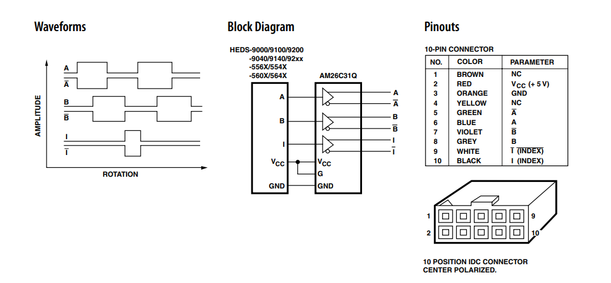

# 研究室内のスライドレールについて

エンコーダ付きモータで制御する。

<u> 仕様 </u>  
・モータードライバ(VNH5019搭載)  
&emsp;[データシート](https://www.switch-science.com/catalog/1590/)  
・エンコーダ   
&emsp;ピン配置([データシート](https://docs.rs-online.com/3bf7/0900766b8130f67c.pdf))  
   

<u>動作テスト</u>  
・[テスト](./test.md)  

## 参考
[1] [Pololu-VNH5019ボード＋Arduinoでモーター制御](https://yunit.techblog.jp/archives/57578349.html)
 

### 編集者

吉澤