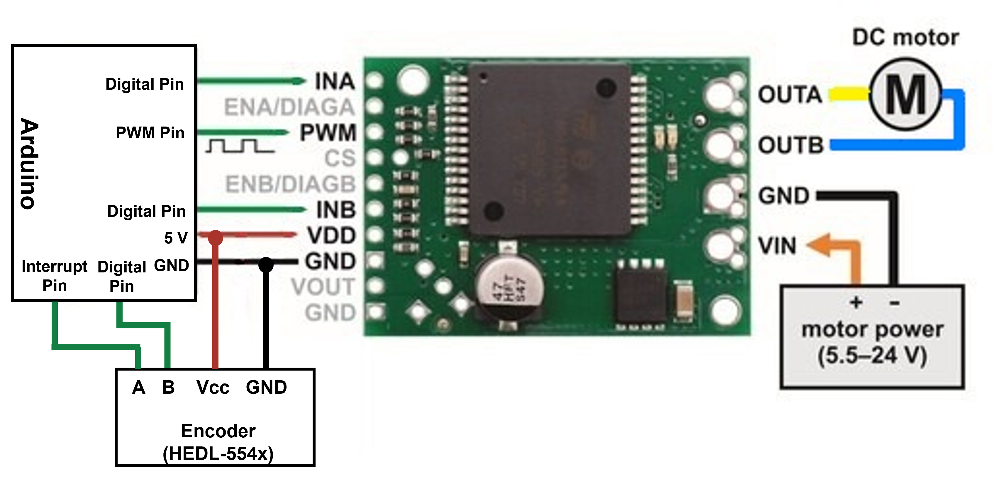

# 動作テスト

## 速度一定で動かすサンプル
<u> 回路 </u>  
　   

<u>Arduinoコード</u>

```
//ピン番号
/*-----モータ-----*/
#define MOTORA 10
#define MOTORB 7
#define MOTORP 11
/*-----エンコーダ-----*/
#define PINENCA 2
#define PINENCB 4

//プロトタイプ宣言
void Pid_calc();
void EncCount();

//変数定義
/*-----エンコーダ-----*/
volatile int pulses;
volatile bool currDir;
unsigned char pinENCA;
unsigned char pinENCB;

/*-----目標設定-----*/
float target_vel = 0.1;  // 目標速度

/*----エンコーダ----*/
int encValue;         // エンコーダ値
int oldencValue;      // 直前のエンコーダ値

/*-----PID-----*/
float pid = 0.0;             // T = Kp * e + Kd * e'+ Ki * ∫edt
float kp = 230;              // P制御の係数
float ki = 0;                // I制御の係数
float kd = 0;                // D制御の係数
float f = 220;
float prevP;

unsigned long oldtime = 0;
unsigned long now = 0;
float all_time = 0;

/*-----モータ-----*/
int motorPWM = 0;
const int maxPWM = 255;       // モータトルク最高
const int minPWM = 0;         // モータトルク最低
const int EPR = 2400;         // モータ一回転あたりのエンコーダ値 
const float r = 0.015;        
const float CM = 2*r*3.1415;  // 円周

void Pid_calc() {
  encValue = pulses;
  int diffencValue = encValue - oldencValue;
  oldencValue = encValue;

  now = micros();
  float dt =((float)(now - oldtime))/1000000.0;
  all_time += dt;
  /*---PIDによるモータ制御---*/
  float P,I,D;

  float v = ((float)diffencValue/(float)EPR*CM)/dt;
  
  P = target_vel - v;                   // 比例項 目標速度-現在の速度                
  I += P;                               // 積分項 比例項の総和
  D = (P - prevP)/ dt;                  // 微分項 エンコーダ値-直前のエンコーダ値=角速度
  pid = kp * P + ki * I + kd * D + f;
  prevP = P;

  if(v != 0) Serial.println(v,4); 

  int motorSpeed = 0;
  motorSpeed = f*target_vel;
  motorSpeed += (int)pid;
  // PWM制限
  motorPWM = constrain(abs(motorSpeed), minPWM, maxPWM);

  oldtime = now;
}

// エンコーダーの処理
void EncCount() {                             // A相変化時に処理
  //currDir=!(digitalRead(PINENCA)^digitalRead(PINENCB));
  currDir = !(((PIND >> 2) & 0b00000001) ^ ((PIND >> 4) & 0b00000001));
  currDir == HIGH ? ++pulses : --pulses;
}

void setup() {
  TCCR2B = TCCR2B & B11111000 | B00000001;     //3,11番pinのpwmを高周波化
  pinMode (MOTORA, OUTPUT);
  pinMode (MOTORB, OUTPUT);
  pinMode (MOTORP, OUTPUT);
  pinMode(PINENCA, INPUT);
  pinMode(PINENCB, INPUT);
  Serial.begin(9600);
  attachInterrupt(PINENCA - 2, EncCount, RISING);
}

void loop() {
    if(all_time > 1){
      target_vel *= -1;
      all_time = 0.0;
    }
    Pid_calc();

    // モータ回転
    analogWrite(MOTORP, motorPWM);
    if (target_vel >= 0)
    { // 正転
      digitalWrite(MOTORB, HIGH);
      digitalWrite(MOTORA, LOW);
    }
    else
    { // 逆転
      digitalWrite(MOTORA, HIGH);
      digitalWrite(MOTORB, LOW);
    }
   
}
```