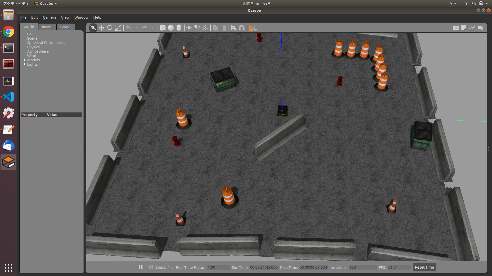

# Huskyのシミュレーション
HuskyのGazeboへの導入と制御方法について説明する。

## HUSKYについて[[1]](https://www.altech.co.jp/item/clearpath)
> 「HUSKY（ハスキー）」は、中規模のロボット開発プラットフォームです。その大きなペイロード容量と電力システムは、研究ニーズを満たすためにカスタマイズされた広範囲のペイロードを収容できます。ステレオカメラ、LIDAR、GPS、IMU、マニピュレータなどを、当社統合エキスパートによりUGVに追加できます。ハスキーの頑丈な構造と高トルクのドライブトレインは、他のロボットが行けないところであなたの研究を進めることができます。ハスキーはコミュニティ主導のオープンソースコードでROSにより完全にサポートされています。

<br>

## Gazeboへの導入
1. Husky関連のパッケージをインストール( apt-get )  
    apt-getから (他のパッケージもあるので必要なら入れる)[[2]](https://qiita.com/MoriKen/items/8387b279e968368783f1)
   ```
   $ sudo apt-get update 
   $ sudo apt-get install ros-$ROS_DISTRO-husky-gazebo 
   $ sudo apt-get install ros-$ROS_DISTRO-husky-viz 
   ```

   githubからのインストールではビルドエラーが出る。  
   必要なパッケージがインストールされないため。
   
   <br>

2. 動作確認  
   Husky シミュレータの起動（gazebo）  
   図のGazebo環境とrvizが立ち上がる。  
   ジョイコンをつなげれば，制御もできる。  
   ```
   $ roslaunch husky_gazebo husky_playpen.launch
   $ roslaunch husky_viz view_robot.launch
   ```
   
   

<br>   

## 参考
[1] [無人自律走行車両「JACKAL」「HUSKY」（Clearpath Robotics社)](https://www.altech.co.jp/item/clearpath)  
[2] [Navigation Stack を理解する - 2.1 move_base: ROSで遊んでみる](https://qiita.com/MoriKen/items/8387b279e968368783f1)